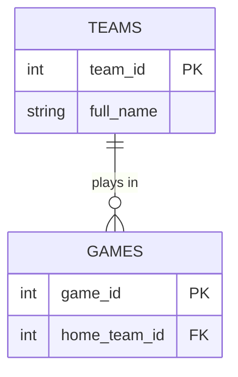
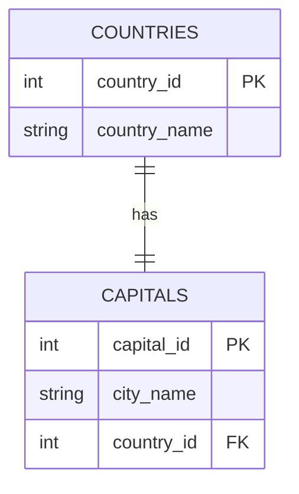
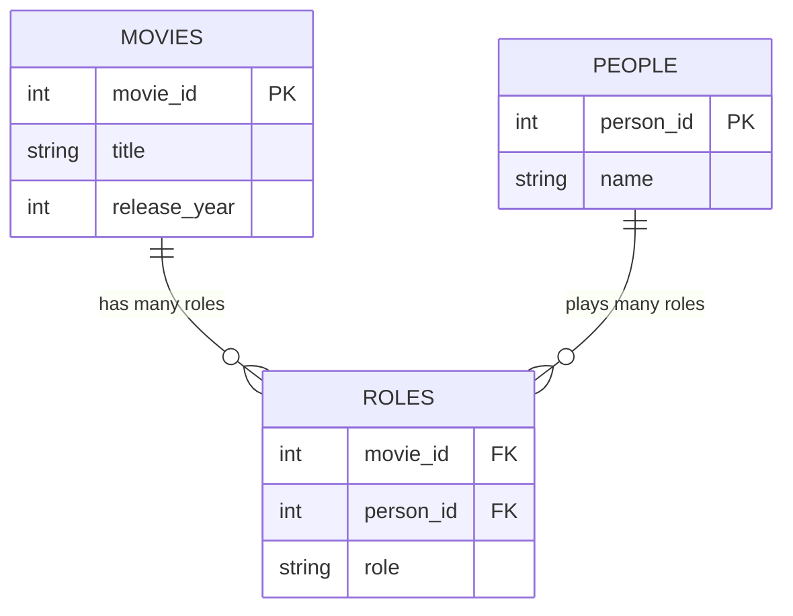

```mermaid
erDiagram
    TEAMS ||--o{ GAMES : "plays in"
    TEAMS {
        int team_id PK
        string full_name
    }
    GAMES {
        int game_id PK
        int home_team_id FK
    }
```

```mermaid
erDiagram
    COUNTRIES ||--|| CAPITALS : "has"
    COUNTRIES {
        int country_id PK
        string country_name
    }
    CAPITALS {
        int capital_id PK
        string city_name
        int country_id FK
    }
```

```mermaid
erDiagram
    MOVIES ||--o{ ROLES : "has many roles"
    PEOPLE ||--o{ ROLES : "plays many roles"
    MOVIES {
        int movie_id PK
        string title
        int release_year
    }
    PEOPLE {
        int person_id PK
        string name
    }
    ROLES {
        int movie_id FK
        int person_id FK
        string role
    }
```